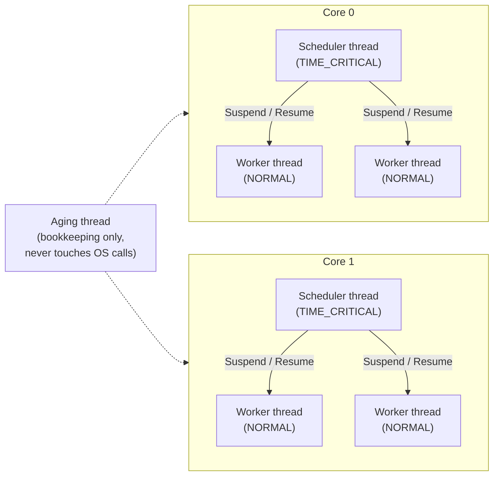
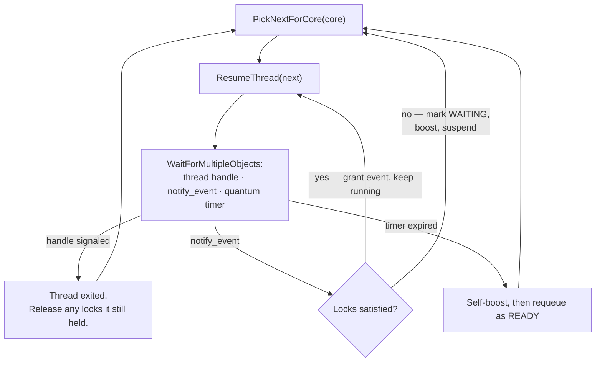
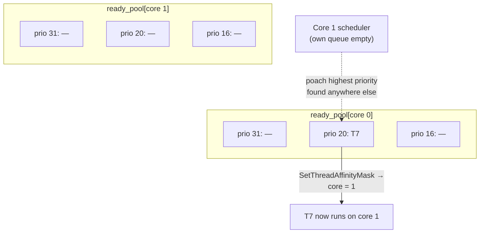
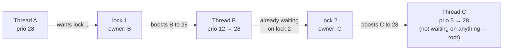

# ThreadHandler

A handmade priority scheduler for real Windows threads. Sixteen-plus worker
threads run genuine `CreateThread`/`SuspendThread`/`ResumeThread` OS threads.
This program decides, entirely in user mode, which of them actually get to
run fairly. It uses auto-boosting, and is multithreaded with a scheduler
thread per core. Every context switch here is a real Windows API call, 
and every constraint that follows from that (asynchronous suspend, 
affinity, real-time priority ranges) is handled explicitly rather than assumed away.

## What's actually running

Four kinds of thread exist, each with one job:

| Thread             | Count       | Job                                                              |
|---------------------|-------------|-------------------------------------------------------------------|
| **Worker**           | `2 × cores` | Does simulated work; holds 1–2 of 4 simulated locks while doing it |
| **Core scheduler**   | 1 per core  | Decides who runs on its core; the only thread allowed to call `SuspendThread`/`ResumeThread` |
| **Aging thread**     | 1           | Periodically boosts anyone who's been waiting too long             |
| **Main**             | 1           | Sets everything up, then blocks until every worker exits           |



Workers never suspend themselves, and never touch a lock's metadata
directly. Both of those are deliberate: a thread suspending *itself* races
against its own continued execution (`SuspendThread` doesn't take effect
synchronously), so the only thread ever allowed to suspend a worker is its own core's scheduler.

## The scheduling loop

Each core's scheduler runs one worker at a time and waits on exactly three
things: the worker's own thread handle (fires when it exits naturally), a
`notify_event` the worker signals when it wants a lock acquired or released,
and a waitable timer standing in for the worker's time quantum.



A lock grant doesn't hand the core to anyone else. The same worker keeps
running on a fresh quantum. Only an exit, a block, or quantum expiry sends
the scheduler back to `PickNextForCore` to choose someone new.

## Ready queues, one per core (with poaching)

There's no single global run queue. Each core owns its own set of 32
priority buckets (`ready_pool[core][priority]`), each an `SRWLOCK`-guarded
doubly linked list. A scheduler always looks at its **own** buckets first;
only when its own queue is completely empty does it poach the
highest-priority thread from whichever other core actually has one,
reassigning that thread's CPU affinity to itself in the process.



Priority always wins the poach. A core never steals a low-priority thread
just because it's the nearest one. But a core's own queue always wins over
poaching at all, even against a higher-priority thread sitting idle
elsewhere: work-stealing only kicks in once there's genuinely nothing local
left to run.

## Priority inheritance across locks

Four simulated locks exist purely to create contention. When a thread finds
one already held, it does two things before it actually blocks: it
recomputes its own priority in case something is already waiting on a lock
*it* owns, then walks outward from the lock it wants, through that lock's
owner, to whatever *that* owner is waiting on, and so on, boosting every
underprivileged link in the chain so a low-priority thread can never sit on
a resource a high-priority thread needs.



The walk keeps going even past an owner that already looks high enough priority because a
boost that landed further down the chain earlier doesn't guarantee
everything *behind* that owner was raised to today's requirement, so
short-circuiting there would be a real bug, not just a missed optimization.
It only stops at a thread that isn't waiting on anything, or if it revisits
an owner it's already seen (which means an actual deadlock because it's out of order, not a chain to
keep boosting).

When a lock is released, it goes to the **highest-priority** waiter, not the
one who's been waiting longest.

## Priority mechanics

| Constant              | Value                    | Meaning                                                          |
|------------------------|---------------------------|-------------------------------------------------------------------|
| `NUM_PRIORITIES`        | 32                         | Priority levels, 0 (lowest) to 31 (highest)                       |
| `BASE_RUNNING_AMOUNT`   | 50 ticks                  | Quantum floor, granted at priority 0                               |
| `RUNNING_AMOUNT_STEP`   | 5 ticks / priority level   | Extra quantum per priority level above 0                          |
| `TICK_MS`               | 5 ms                       | Length of one tick, and the aging sweep's cadence                  |
| `AGE_THRESHOLD`         | 50 ticks (250 ms)          | How long a READY/WAITING thread waits before it earns a priority bump |
| `NUM_LOCKS`             | 4                          | Two independent contention pairs: locks 1↔2 and locks 3↔4          |

A thread's quantum in milliseconds is `(50 + priority × 5) × 5` (a
priority-0 thread gets 250 ms per dispatch; a priority-31 thread gets
1025 ms). Priority is recomputed at *every* dispatch, not fixed at creation,
so a currently-boosted thread gets a longer quantum than its base priority
alone would grant.

Real OS thread priority is a separate axis from all of this. Workers sit
uniformly at `THREAD_PRIORITY_NORMAL`; only a core's scheduler is elevated
to `THREAD_PRIORITY_TIME_CRITICAL`, under a process running
`REALTIME_PRIORITY_CLASS`. That combination exists for one reason: a
scheduler and the worker it's managing share a physical core, and the
scheduler has to reliably preempt that worker the instant it's signaled.
Levels 16–31 are also exempt from Windows' own dynamic priority adjustments
(foreground boost, I/O completion boost), so nothing outside this program
ever second-guesses a priority this code assigned.

## Building & running

Windows only. The whole program is built on `SuspendThread`, affinity
masks, and waitable timers.

```
cmake -B cmake-build-debug
cmake --build cmake-build-debug
./cmake-build-debug/ThreadHandler.exe
```

The process asks for `REALTIME_PRIORITY_CLASS`, which most accounts can set
without elevation, but real-time priority is not sandboxed. A stalled
scheduler (or a bug that leaves a worker running with no way to be
suspended) can make the whole machine sluggish, not just this process, since
it can outrank input handling and other system threads. If `main()` prints a
warning that it couldn't set the priority class or a thread priority, the
safety property the design leans on, schedulers always winning against
their workers, is no longer guaranteed.

Output is one printed character per worker thread, chosen from a fixed
alphabet by thread index, so which threads are actually interleaved on the
CPU is visible directly in the console.

## Design decisions worth knowing about

A few things were deliberately left out rather than overlooked:

- **No early preemption.** A newly-ready, higher-priority thread has to wait
  for whatever's currently running on its core to exit, block, or hit
  quantum expiry AKA nothing interrupts a quantum early. Adding that back
  means a fourth signal in the scheduler's wait set.
- **A lock grant re-arms a full fresh quantum**, not the remainder of
  whatever quantum the thread was on before it blocked.

None of these change correctness but they trade a small amount of scheduling
precision for a scheduler loop that stays a single, readable
`WaitForMultipleObjects` on three handles.

## Files

| File                | Contents                                                      |
|----------------------|------------------------------------------------------------------|
| `main.c`              | Workers, schedulers, aging thread, boost chain, `main()`         |
| `ThreadHandler.h`      | `THREAD_CONTROLLER`, `SIM_LOCK`, `LOCKED_LIST`, shared globals    |
| `Lists.c`              | Intrusive doubly-linked list primitives, `SRWLOCK`-guarded        |
